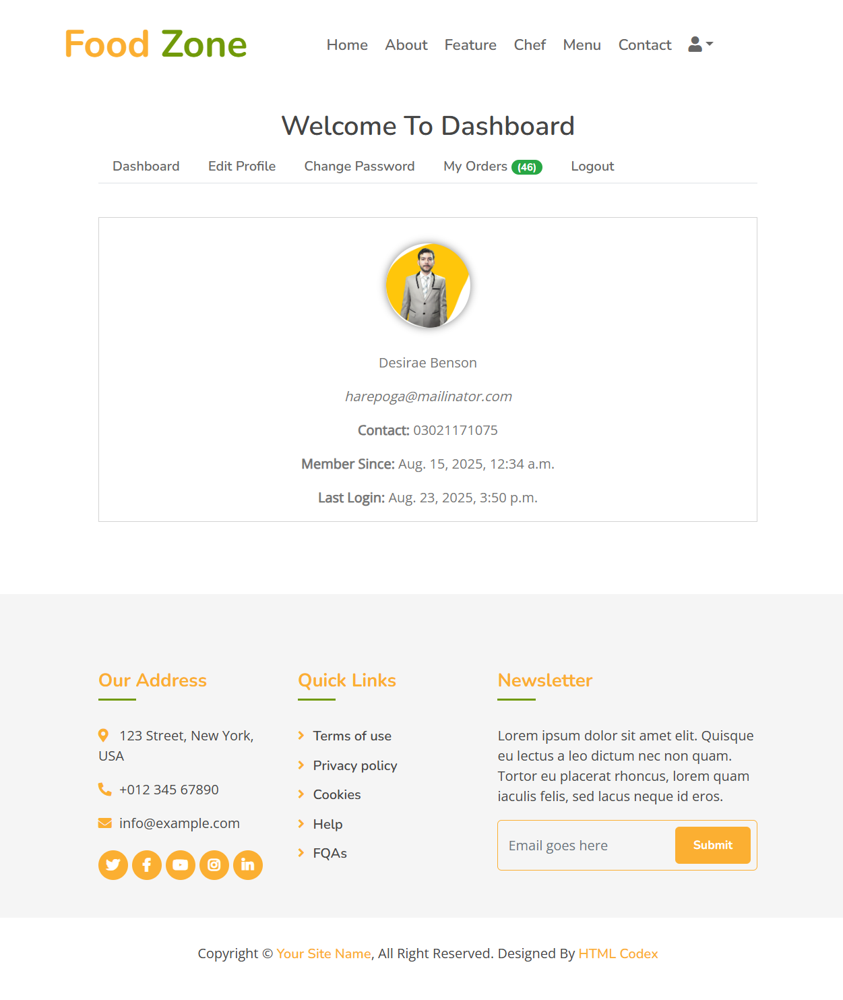
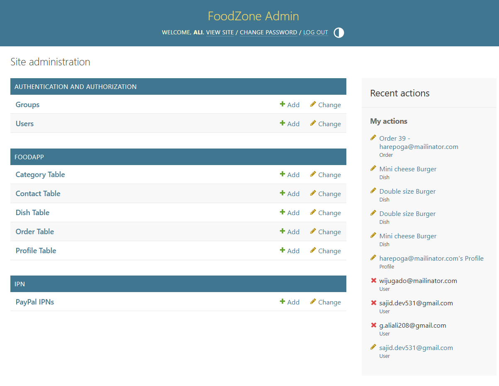

# 🍔 FoodZone – Django Food-Ordering App

A full-featured, **open-source** food-ordering web application built with **Django 4.2**.  
Perfect for learning, cloning, or extending into your own restaurant or cloud-kitchen platform.

---

## 📸 Quick Visual Tour

| Home Page | Menu Listing | Cart & Checkout |
|-----------|--------------|-----------------|
|  |  |  |

*(Screenshots are stored in `static/img/readme/` so the repo is 100 % self-contained and viewable offline.)*

### 🔍 Full Walkthrough Screenshots

Below are **full-page screenshots** of every major flow so visitors can see exactly how the site looks and works **without running the code**.

1. **Home / Landing Page**  
   

2. **Menu Listing (All Dishes)**  
   

3. **Dish Detail**  
   

4. **Shopping Cart**  
   

5. **Checkout & Payment**  
   

6. **Payment Success**  
   

7. **User Dashboard**  
   

8. **Admin Panel**  
   

> **Zero-hosting preview**: All images are committed to the repo, so GitHub renders them instantly—no server or cost required.

---

## 🚀 Features

- ✅ **User Registration / Login / Logout**  
- ✅ **Category & Dish Management** (Admin panel)  
- ✅ **Add-to-Cart & Real-time Total**  
- ✅ **JazzCash & Stripe Payment Gateways**  
- ✅ **Order History & Status Tracking**  
- ✅ **Responsive UI** (Bootstrap 5)  
- ✅ **Admin Dashboard** for CRUD operations  
- ✅ **Static Screenshots** for offline preview

---

## 🛠️ Tech Stack

| Layer        | Technology |
|--------------|------------|
| Backend      | Django 4.2 |
| Database     | SQLite (default) |
| Frontend     | HTML5, Bootstrap 5, JavaScript |
| Payments     | Stripe & JazzCash |
| Icons        | Material Icons |
| Static Files | WhiteNoise (ready for Heroku/Render if needed) |

---

## 📁 Project Structure (high-level)

```
foodzone/
├── foodzone/          # Django settings & URLs
├── foodapp/           # Core business logic & models
├── media/             # User uploads (dishes, profiles)
├── static/            # CSS, JS, images
├── templates/         # HTML templates
├── requirements.txt   # Exact dependency versions
└── README.md          # This file
```


## 🚀 Getting Started: 60-Second Local Setup

**Prerequisites:**
- Python 3.8+
- Git

**Installation & Run:**

```bash
# 1. Clone the repository
git clone https://github.com/<your-username>/foodzone.git
cd foodzone

# 2. Create a virtual environment and activate it
python -m venv venv
source venv/bin/activate  # On Windows, use `venv\Scripts\activate`

# 3. Install dependencies
pip install -r requirements.txt

# 4. Apply database migrations
python manage.py migrate

# 5. Create a superuser to access the admin panel
python manage.py createsuperuser

# 6. (Optional) Load initial demo data
python manage.py loaddata initial_dishes.json

# 7. Run the development server
python manage.py runserver
```

Your application will be available at **http://127.0.0.1:8000**.


## 🔐 Admin Panel

- URL: http://127.0.0.1:8000/admin  
- Use the superuser credentials you just created.


## 🔐 Environment Variables (Optional)

Create a `.env` file in the project root:

```dotenv
SECRET_KEY=your-secret-key
DEBUG=True
STRIPE_PUBLISHABLE_KEY=pk_test_...
STRIPE_SECRET_KEY=sk_test_... # Note: Keep this secret!
JAZZCASH_MERCHANT_ID=...
JAZZCASH_PASSWORD=...
JAZZCASH_INTEGERITY_SALT=...
```

---

## 🧪 Offline Preview (No Hosting Needed)

Because all screenshots and static assets are committed, anyone can:

1. Open the repo in **VS Code** or **GitHub Desktop**.
2. Double-click any `.html` file inside `templates/` to see the layout.
3. Browse `static/img/readme/` for full-page screenshots.

---

## 🤝 Contributing

1. Fork the repo  
2. Create a feature branch (`git checkout -b feature/amazing-feature`)  
3. Commit & push  
4. Open a Pull Request

---

## 📄 License

MIT © [Your Name](https://github.com/<your-username>)

---

> **No hosting fees required** – everything runs locally or can be containerized with Docker in minutes.
