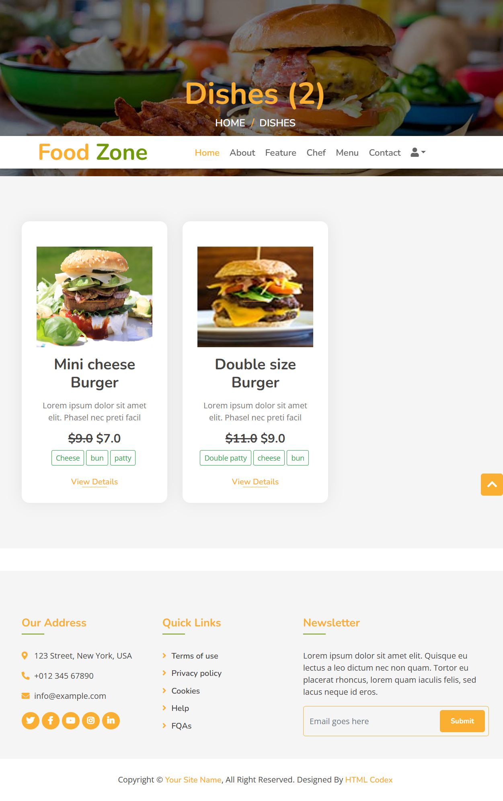

# FoodZone

A Django-based food ordering website with user registration, profile management, catalog of categories and dishes, ordering, and payment integration. The project ships with a responsive Bootstrap UI and an admin backend for content management.


## Highlights (Latest Changes)

- Payments: Implemented JazzCash HMAC payment flow (sandbox) while keeping PayPal IPN endpoints available. The classic PayPal form flow in `views.single_dish` is commented for reference and replaced by JazzCash.
- Orders: Order status handling (Successful/Failed/Pending) with clearer states. Ability to clear an order from the dashboard using a secure POST + confirmation modal.
- Dashboard: Profile editing (name, contact, address, profile picture), and password change flow. Improved messaging via Django messages framework.
- Models: Additional timestamps (`updated_on`) for Category and Dish; `Profile.profile_picture` field.
- Settings: Timezone set to `Asia/Karachi`, media storage configured, `django_bootstrap5` and `paypal.standard.ipn` added, keys for JazzCash/PayPal (use env variables for production).
- Dependencies updated and pinned in `requirements.txt` (Django 5.2.x, Pillow 11.x, etc.).


## Tech Stack

- Backend: Django 5.x
- Frontend: Bootstrap 5, jQuery
- Database: SQLite (default) — can be swapped for Postgres/MySQL
- Payments: JazzCash (Sandbox), PayPal IPN wiring available
- Media: Local filesystem (`MEDIA_ROOT`)


## Project Structure

- foodzone/foodzone/settings.py — base settings, static & media config, payment config
- foodzone/foodzone/urls.py — URL routing
- foodzone/foodapp/models.py — Contact, Profile, Category, Dish, Order
- foodzone/foodapp/views.py — public pages, auth, dashboard, payments (JazzCash)
- foodzone/foodapp/admin.py — model registrations and admin tweaks
- foodzone/template/*.html — templates (base, dashboard, etc.)
- requirements.txt — pinned dependencies
- docs/ — additional markdown docs (example: dashboard.md)


## Features

- Public pages: Home, About, Feature, Team, Menu, Contact
- Auth: Register, Login, Logout
- User Dashboard: profile view/edit, password change, order history, clear orders
- Catalog: Categories and Dishes with images, ingredients, price/discount
- Payments: JazzCash sandbox checkout from dish page; PayPal IPN endpoints present
- Admin: Manage Contacts, Profiles, Categories, Dishes, Orders


## Screenshots

- Home
  
- About
  
- Features
  
- Register / Login
  
  
- All Dishes and Dish Detail
  
  
- Dashboard (Overview, Edit Profile, Change Password)
  
  
  
- Orders (List, Confirmation Modal, Cleared Entry)
  
  
  
- Contact Us
  

More screenshots are available under docs/img/ and corresponding docs/*.md pages.


## Routes

From `foodzone/urls.py`:
- / — Home
- /about/ — About page
- /contact/ — Contact form (persists to Contact model)
- /register/ — Registration
- /login/ — Sign in
- /logout/ — Sign out
- /dashboard/ — Authenticated user dashboard
- /dishes/ — All dishes with optional filter by category (?q=<category_id>)
- /dish/<id>/ — Dish detail + create order and prepare payment (POST)
- /dish/<id>/buy/ — Create an order (POST-only) then redirect to payment flow
- /clear_order/<order_id>/clear/ — Clear an order (POST-only)
- /paypal/ — django-paypal IPN endpoints
- /payment-done/ — Payment success handler
- /payment-cancelled/ — Payment cancel/failure handler

Note: Admin is available at /admin/


## Models Overview

- Contact: name, email, subject, message, created_at, is_approved
- Profile: user (OneToOne), profile_picture, contact, address, updated_on
- Category: name (unique), image, icon, description, added_on, updated_on
- Dish: name (unique), image, ingredients, details, category (FK), price, discounted_price, is_available, added_on, updated_on
- Order: customer (Profile FK), item (Dish FK), status (bool), invoice_id, payer_id, ordered_on


## Requirements

See requirements.txt for exact versions. Core:
- Django==5.2.5
- django-bootstrap5==25.2
- django-paypal==2.1
- Pillow==11.3.0

Dev/docs tooling present: mkdocs, mkdocs-material, etc. (optional)

Python: 3.10+ recommended (project tested with modern Python versions). On Windows, use a venv.


## Configuration

For development, the project includes example values in settings.py. For production, configure with environment variables and do not commit secrets.

Suggested .env (example):

```
DJANGO_SECRET_KEY=your-strong-secret-key
DJANGO_DEBUG=False
DJANGO_ALLOWED_HOSTS=yourdomain.com,localhost

# PayPal
PAYPAL_RECEIVER_EMAIL=your-paypal-merchant@example.com
PAYPAL_TEST=True

# JazzCash (Sandbox/Test)
JAZZCASH_MERCHANT_ID=MCxxxxxxxx
JAZZCASH_PASSWORD=********
JAZZCASH_INTEGRITY_SALT=********
JAZZCASH_RETURN_URL=https://yourdomain.com/payment-done/
JAZZCASH_CANCEL_URL=https://yourdomain.com/payment-cancelled/
JAZZCASH_POST_URL=https://sandbox.jazzcash.com.pk/CustomerPortal/transactionmanagement/merchantform/
```

Then load them in settings.py (consider python-dotenv or os.environ) and remove hardcoded values.

Media:
- MEDIA_URL=/media/
- MEDIA_ROOT=<project_root>/media

Static:
- STATIC_URL=/static/
- STATICFILES_DIRS=[<project_root>/static]


## Getting Started (Local Development)

1) Clone and create virtual environment

- Windows (PowerShell):
```
python -m venv .venv
.\.venv\Scripts\Activate.ps1
```

2) Install dependencies
```
pip install --upgrade pip
pip install -r requirements.txt
```

3) Apply migrations and create a superuser
```
python manage.py migrate
python manage.py createsuperuser
```

4) Run the development server
```
python manage.py runserver
```

Visit http://127.0.0.1:8000 and http://127.0.0.1:8000/admin

5) Add content
- Log in to /admin to create Categories and Dishes (ensure images exist)
- Register as a user and update your profile in /dashboard/


## Payment Flow (JazzCash)

- On a Dish detail page (`/dish/<id>/`), submit a POST to create an Order and prepare JazzCash parameters.
- The server computes the HMAC SHA-256 `pp_SecureHash` using `JAZZCASH_INTEGRITY_SALT` over ordered fields.
- The template posts to the JazzCash sandbox endpoint; user completes payment.
- JazzCash returns to `payment_done` on success or `payment_cancel` on failure/cancel.

Note:
- Current success handler trusts POST presence of `pp_ResponseCode` and tries to match `invoice_id` to update Order status.
- For GET fallbacks, `payment_done` will mark pending orders as successful (intended for sandbox; do not use this in production). For production, implement proper IPN/verification and remove GET-based success.


## Admin Configuration

- Admin header is customized to "FoodZone Admin".
- Contact model shows basic list fields.
- Manage all content: Contact, Profile, Category, Dish, Order.


## Security and Production Notes

- Never commit real payment keys or the Django SECRET_KEY. Use environment variables.
- Set `DEBUG=False` and populate `ALLOWED_HOSTS` in production.
- Serve static and media via a proper web server/CDN. Run `python manage.py collectstatic` and configure STATIC_ROOT.
- Use HTTPS and secure cookies/settings.
- Replace the GET fallback in `payment_done` with verified callbacks and/or a polling mechanism.


## Troubleshooting

- Media not showing: Ensure MEDIA_URL/MEDIA_ROOT are configured and that you include `urlpatterns += static(settings.MEDIA_URL, document_root=settings.MEDIA_ROOT)` in DEBUG.
- Payment keys invalid: Use JazzCash sandbox credentials and ensure the HMAC "ordered keys" match the provider documentation.
- Login after password change: The code re-logs the user; if sessions expire, prompt for login again.


## Documentation

- See docs/dashboard.md for additional UI notes. If you want a full site, add an `mkdocs.yml` and run:
```
mkdocs serve
```


## License

This project is provided for educational purposes. Add your preferred license (e.g., MIT) here.
