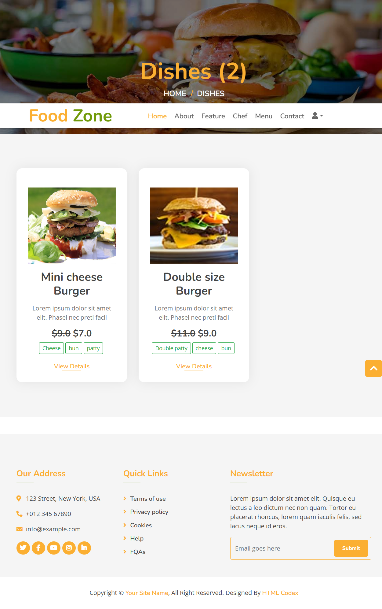
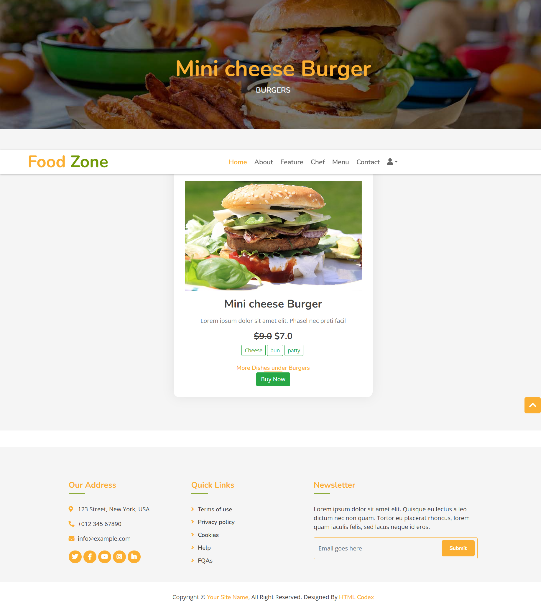

# All Dishes Page (`all_dishes.html`)

This template is responsible for displaying a list of all available dishes, either all of them or filtered by a specific category.

## Structure

After clicking on view details link, Buy now will take the buyer to Jazzcash website for payment

The template extends from `base.html` and overrides the `content` block. It's divided into two main sections:

1.  **Page Header**: Displays the title of the page.
2.  **Food Display**: Shows the grid of food items.

### Page Header

-   **Title**: The header dynamically displays the title.
    -   If the dishes are filtered by a category (e.g., `/dishes/?q=1`), it will show the category name, like `Burgers`.
    -   If no filter is applied, it defaults to `Dishes`.
    -   It also shows the total count of the dishes being displayed.
-   **Breadcrumbs**: Simple navigation links back to "Home" and "Dishes".

```html
<!-- Page Header Start -->
<div class="page-header mb-0">
    <div class="container">
        <div class="row">
            <div class="col-12">
                <h2> {{dish_category}} Dishes ({{dishes|length}})</h2>
            </div>
            <div class="col-12">
                <a href="/">Home</a>
                <a href="/dishes">Dishes</a>
            </div>
        </div>
    </div>
</div>
<!-- Page Header End -->
```

### Food Display Section

This section iterates through the `dishes` context variable provided by the `all_dishes` view and displays each dish in a card-like format within a responsive grid.

-   **Grid Layout**: Each dish is placed in a `col-md-4` column, creating a three-column layout on medium-sized screens and larger.
-   **Dish Availability**:
    -   If a dish is not available (`i.is_available` is `False`), the background of the item is set to `lightgray` to visually distinguish it.
    -   A "Not Available for delivery!" message is shown, and the "View Details" link is hidden.

#### Dish Item Details

For each dish, the following details are displayed:

1.  **Image**:
    -   The dish image is displayed using `{{ i.image.url }}`.
    -   The image is wrapped in an `<a>` tag, making it clickable to open the full-size image in a new tab.
    -   This is how multiple images are handled: the template loops through each dish object and renders its specific image, creating a gallery of all dishes.

    ```html
    <a href="{{ i.image.url }}" target="_blank">
        
    </a>
    ```

2.  **Name**: The name of the dish (`{{i.name}}`).
3.  **Details**: A short description of the dish (`{{i.details}}`).
4.  **Price**:
    -   If the dish has a discount (`i.price != i.discounted_price`), the original price is shown with a strikethrough (`<del>`).
    -   The final (or discounted) price is always displayed in bold.
5.  **Ingredients**: A small script splits the comma-separated `ingredients` string and displays each ingredient as a styled badge.
6.  **View Details Link**: If the dish is available, a link to the single dish page (``) is provided for more details.

## View Logic (`foodapp/views.py`)

The `all_dishes` view in `views.py` controls the data sent to this template.

-   By default, it fetches all `Dish` objects from the database.
-   It supports filtering via a URL query parameter `q`. For example, `http://127.0.0.1:8000/dishes/?q=1` will fetch all dishes where the category ID is `1`.
-   The view passes the following context to the template:
    -   `dishes`: A queryset of `Dish` objects to be displayed.
    -   `dish_category` (optional): The name of the category if the dishes are filtered.

This setup allows the `all_dishes.html` template to be a flexible page for showcasing all food items offered on the website.
