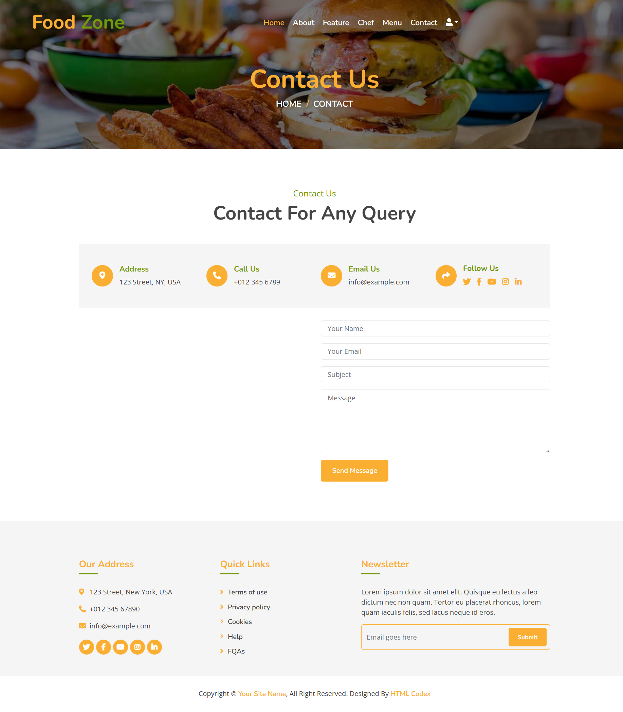

# Contact Page

This page documents the Contact template used in the FoodZone project.

- Template: `template/contact.html`
- Purpose: Provide users with contact information, Google Maps location, and a contact form to submit inquiries.

## Screenshot



## Key Features

- Page header with breadcrumb navigation (Home → Contact)
- Contact information cards:
  - Address
  - Phone
  - Email
  - Social links
- Embedded Google Map showing the location
- Contact form with the following fields:
  - Name (required)
  - Email (required)
  - Subject (required)
  - Message (required)
- CSRF protection enabled
- On successful submission, a success message is displayed and the page redirects to the Contact route

## Template Highlights

```html

<script>
    alert("{{ message }}");
    window.location.href = "";
</script>

```

The form posts to the `contact` URL and includes CSRF protection:

```html
<form name="sentMessage" method="post" action="">
  
  <!-- name, email, subject, message fields -->
  <button class="btn custom-btn" type="submit">Send Message</button>
</form>
```

## Backend Expectations

- URL name: `contact`
- View should handle POST requests, validate inputs, and set a context variable `message` on success to trigger the alert-and-redirect block.

## Notes

- Update the placeholder contact details (address, phone, email, and social links) to reflect your real information.
- Replace the default Google Maps `iframe` location with your actual coordinates if needed.
