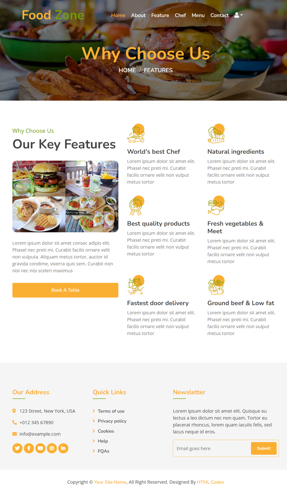

# 🚀 Features

FoodZone is a comprehensive online food ordering platform with a rich set of features designed to provide a seamless experience for both customers and administrators.



## Core Functionality

### 👤 User Management

Our user management system provides full control over user accounts.

- **User Registration & Login:** Secure and easy-to-use authentication system. Users can sign up, log in, and log out.
- **Profile Management:** Users can view and update their personal information, including name, contact details, and delivery addresses.
- **Order History:** A dedicated section for users to track their past and current orders, view order details, and see the status of their deliveries.

### 🍔 Menu System

A dynamic and easy-to-navigate menu system is at the heart of FoodZone.

- **Category Organization:** Dishes are organized into categories (e.g., Appetizers, Main Courses, Desserts, Drinks) for easy browsing.
- **Dish Details:** Each dish has a dedicated page with a high-quality image, detailed description, price, and ingredients.
- **Search and Filtering:** Powerful search functionality allows users to find dishes by name. Filtering options help narrow down choices by category, price, or dietary preferences (e.g., vegetarian, gluten-free).

### 🛒 Order Processing

A streamlined ordering process from cart to checkout.

- **Add to Cart:** Simple one-click "Add to Cart" functionality for all menu items.
- **Shopping Cart:** A detailed view of the cart where users can modify item quantities or remove items.
- **Real-time Price Calculation:** The total order price is updated in real-time as items are added or modified, including any applicable taxes or service charges.
- **Secure Checkout:** A multi-step checkout process that guides the user through providing a delivery address, choosing a payment method, and confirming the order.

## 💳 Payment Integration

We support multiple payment gateways to cater to a wide range of customers.

| Gateway | Status | Features |
|---------|--------|----------|
| Stripe | ✅ Live | Credit/Debit cards, Apple Pay, Google Pay |
| JazzCash | ✅ Live | Mobile wallet, local bank transfers |
| PayPal | 🚧 Planned | International |

## ⚙️ Admin Features

A powerful admin dashboard for managing the application.

The Django admin interface is customized to provide administrators with the tools they need to manage the platform efficiently.

=== "Admin Configuration"

    ```python title="foodzone/foodapp/admin.py"
    from django.contrib import admin
    from . import models

    @admin.register(models.Contact)
    class ContactAdmin(admin.ModelAdmin):
        list_display = ('name', 'email', 'subject', 'created_at', 'is_approved')
        list_filter = ('is_approved', 'created_at')
        search_fields = ('name', 'email', 'subject', 'message')

    @admin.register(models.Profile)
    class ProfileAdmin(admin.ModelAdmin):
        list_display = ('user', 'phone_number', 'address')
        search_fields = ('user__username', 'phone_number')

    @admin.register(models.Category)
    class CategoryAdmin(admin.ModelAdmin):
        list_display = ('category_name', 'slug')
        prepopulated_fields = {'slug': ('category_name',)}

    @admin.register(models.Dish)
    class DishAdmin(admin.ModelAdmin):
        list_display = ('dish_name', 'category', 'price', 'is_available')
        list_filter = ('is_available', 'category')
        search_fields = ('dish_name', 'category__category_name')

    @admin.register(models.Order)
    class OrderAdmin(admin.ModelAdmin):
        list_display = ('user', 'order_date', 'status', 'total_amount')
        list_filter = ('status', 'order_date')
        search_fields = ('user__username',)
    ```

=== "Model Example"

    ```python title="foodzone/foodapp/models.py"
    from django.db import models
    from django.contrib.auth.models import User

    class Category(models.Model):
        category_name = models.CharField(max_length=100)
        slug = models.SlugField(max_length=100, unique=True)
        
        def __str__(self):
            return self.category_name

    class Dish(models.Model):
        dish_name = models.CharField(max_length=200)
        category = models.ForeignKey(Category, on_delete=models.CASCADE)
        price = models.DecimalField(max_digits=10, decimal_places=2)
        description = models.TextField()
        image = models.ImageField(upload_to='dishes/')
        is_available = models.BooleanField(default=True)
        
        def __str__(self):
            return self.dish_name
    ```

=== "View Example"

    ```python title="foodzone/foodapp/views.py"
    from django.shortcuts import render, get_object_or_404
    from .models import Dish, Category
    from cart.forms import CartAddProductForm

    def dish_list(request, category_slug=None):
        category = None
        categories = Category.objects.all()
        dishes = Dish.objects.filter(is_available=True)
        
        if category_slug:
            category = get_object_or_404(Category, slug=category_slug)
            dishes = dishes.filter(category=category)
            
        return render(request, 'foodapp/dish_list.html', {
            'category': category,
            'categories': categories,
            'dishes': dishes
        })

    def dish_detail(request, id, slug):
        dish = get_object_or_404(Dish, id=id, slug=slug, is_available=True)
        cart_dish_form = CartAddProductForm()
        
        return render(request, 'foodapp/dish_detail.html', {
            'dish': dish,
            'cart_dish_form': cart_dish_form
        })
    ```

## 🎯 Key Technical Features
# Real-time cart updates using JavaScript

## 🎯 Key Technical Features

=== "Frontend (JavaScript)"
    ```javascript title="Real-time Cart Updates"
    // Real-time cart updates using JavaScript
    function updateCartTotal() {
        let total = 0;
        document.querySelectorAll('.cart-item').forEach(item => {
            const price = parseFloat(item.dataset.price);
            const quantity = parseInt(item.querySelector('.quantity').value);
            total += price * quantity;
        });
        document.getElementById('cart-total').textContent = total.toFixed(2);
    }

    // Event listener for quantity changes
    document.querySelectorAll('.quantity').forEach(input => {
        input.addEventListener('change', updateCartTotal);
    });
    ```

=== "Backend (Python)"
    ```python title="Django Signals for Order Processing"
    from django.db.models.signals import post_save
    from django.dispatch import receiver
    from .models import Order
    from .utils import send_order_confirmation_email

    # Django signals for order processing
    @receiver(post_save, sender=Order)
    def update_order_status(sender, instance, created, **kwargs):
        if created:
            send_order_confirmation_email(instance)
    ```

=== "Template (HTML)"
    ```html title="Cart Item Template"
    <div class="cart-item" data-price="{{ item.price }}">
        <h4>{{ item.dish_name }}</h4>
        <p>Price: ${{ item.price }}</p>
        <label>Quantity:
            <input type="number" class="quantity" value="{{ item.quantity }}" min="1">
        </label>
    </div>
    <div id="cart-total">Total: $0.00</div>
    ```
