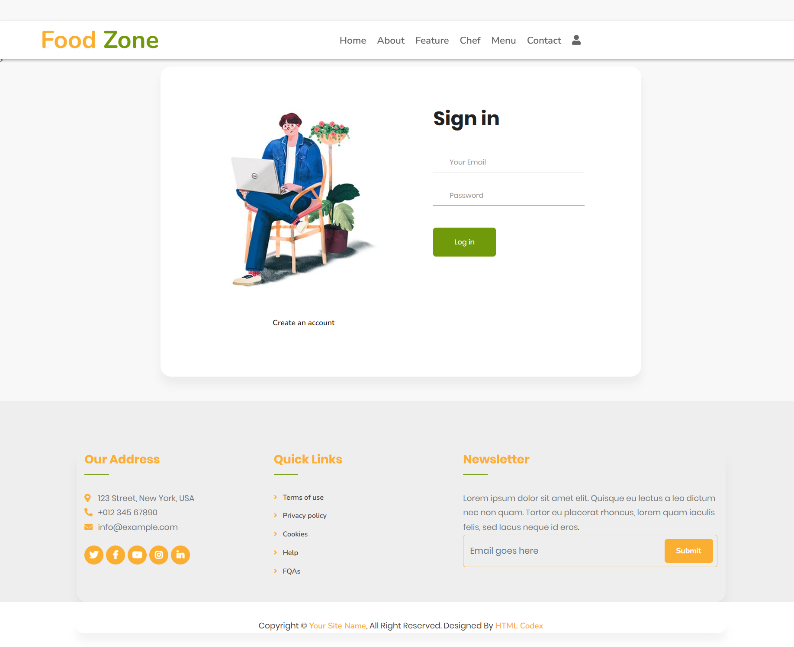

# Login Page

This page documents the user sign-in flow and template in the FoodZone project.

- Template: `template/login.html`
- Purpose: Authenticate existing users via email and password.

## Screenshot



## How to Access

- From the sign up (Register) page, the text/link “Already a member?” (or its equivalent) should route users to the Login page.
- The Login page may also be exposed directly via a route named `login` (e.g., `/login/`).

## Template Notes

The form collects:
- `email`
- `password`

Feedback messages are shown using `message` and `class` variables in context.

Relevant snippet:

```html
<form method="POST" class="register-form" id="login-form">
  
  
    <div class="form-group">
      <p class="alert {{class}}">{{message}}</p>
    </div>
  
  <div class="form-group">
    <label for="your_name"><i class="zmdi zmdi-account material-icons-name"></i></label>
    <input type="email" name="email" id="your_name" placeholder="Your Email" required />
  </div>
  <div class="form-group">
    <label for="your_pass"><i class="zmdi zmdi-lock"></i></label>
    <input type="password" name="password" id="your_pass" placeholder="Password" required />
  </div>
  <div class="form-group form-button">
    <input type="submit" name="signin" id="signin" class="form-submit" value="Log in" />
  </div>
</form>
```

The login template provides a link to the Register page for new users:

```html
<a href="" class="signup-image-link">Create an account</a>
```

## UX Behavior With Sign Up Page

On the Sign Up page (Register), include an “Already a member?” link that directs to the Login page, for example:

```html
<a href="" class="signin-image-link">Already a member? Sign in</a>
```

This ensures a clear path between registration and sign-in flows.

## Expected Backend Behavior

- The Login view should validate the provided email and password, authenticate, and establish a session on success.
- On failure, set `message` and an appropriate `class` for UI feedback.
- CSRF protection should be in place for POST requests.
